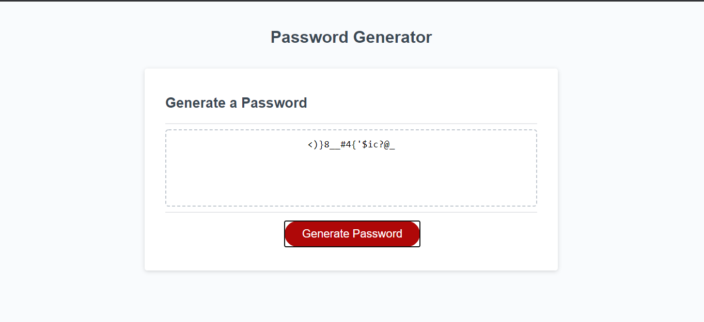

# Unit 3 Homework

In this homework project I was tasked to refactor existing code to make a working password generator. The code already present was responsible for creating a button and display area for the generated password. My job was to add the javascript that would make the password work for three sets of criteria. 

The objectives to complete this homework include the following:
* Clicking "Generate Password" button asks for criteria
* The length set between 8 and 128 characters
* Include upper case letters, numbers and/or special characters
* The input has to be validated by the user
* The generated password is then displayed in the box

View Live Webpage!
https://alec74.github.io/Password-Maker/